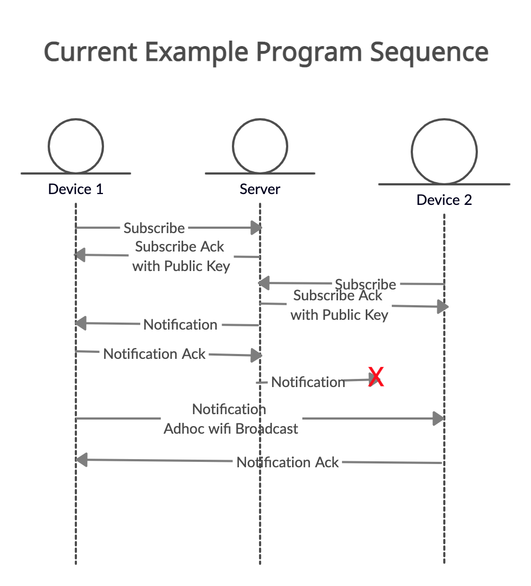

# ns3-wildfire-application
This is an [ns-3](https://www.nsnam.org) based simulation for implementing and testing a new wireless emergency alert protocol that would continue to work when netowork connectivity is not available.

This protocol was inspired by events that occured during the 2020 wildfires in Oregon, where many residents did not get the notification to evacuate when strong winds resulted in the evacuation status rapidly changing while local power disrupotions caused a loss of internet access for residents. An article describing this event can be found here: 
https://www.statesmanjournal.com/story/news/2020/09/28/failed-oregon-wildfire-emergency-evacuation-alerts-questions-future-disasters-earthquake/5792075002/ 

# Protocol Design Goals
The wildfire protocol has the following design goals, listed in
priority order, which should be used to guide tradeoffs between
different design choices.

## Fundamental Goal
1. **Offline notification capabilities**
    * Our protocol's number one goal is do whatever it takes to get notifications
    to people who have not recieved them. 
    * Our protocol must work in enviroments currently impacted by wildfire
    events and thus must work in situations where internet connectivity
    is not available from typical wireless carriers.
## Second Level Goals
1. **Security**
    * Our protocol must ensure that all notifications can be authenticated
    to ensure that it came from a trusted source.
    * Our protocol must treat all interactions with other devices
    assuming that they cannot be trusted and should provide safeguards from
    abuse.
1. **Energy Efficiency**
    * Our protocol must minimize energy usage when possible.
    * Our protocol must react to remaining device energy appropriately.
1. **Eventual Consistency**
    * Our protocol must rely on delayed updates to know if a message was eventually
    received or not. 

# NS-3 Example Program
The diagram below shows the current sequence that is running in the example program. In this sequence, both devices subscribe while connected to the internet. One device is disconnected from the internet (but connected to device one over adhoc wifi) and the other device still has a connection. After recieving the notification from the internet, device 1 broadcasts the notification, which device 2 receives and resposne with an acknowledgement. 

# License
"GPL". Please see the file LICENSE in this distribution for license terms.